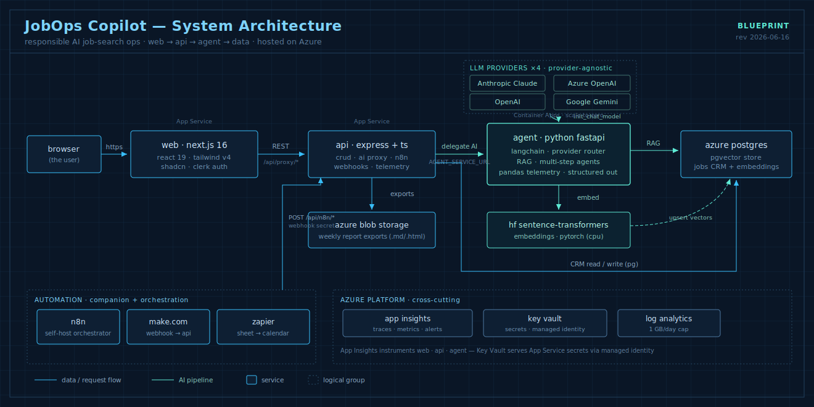
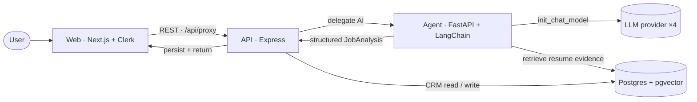
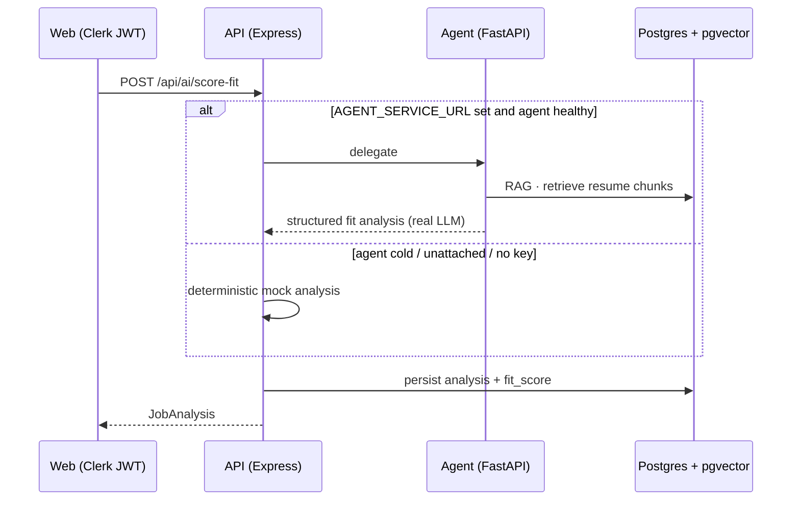

# Architecture

## System Shape (AI-agent platform)

JobOps Copilot is a three-service system plus Postgres. The Node API owns the
CRM and orchestration; a Python service owns the real AI.

> An interactive version (pan, zoom, click any node) is available at
> [`/architecture`](https://jobops-web.azurewebsites.net/architecture) on the live app.

### Key decisions

- **Additive AI, never a rewrite.** `apps/api/src/lib/agent-client.ts` delegates
  to the Python service when `AGENT_SERVICE_URL` is set and **falls back to the
  deterministic mock** on any error — the app always works, with or without an
  LLM key. Shared mappers (`analysisFromParsed`/`analysisFromFit`) keep mock and
  real paths producing identical `JobAnalysis` records.
- **Provider-agnostic LLM.** `services/agent/app/llm/provider.py` uses LangChain
  `init_chat_model` (Anthropic / Azure OpenAI / OpenAI / Gemini). Chains use
  `with_structured_output`; agents use `create_agent` + `ToolStrategy`.
- **RAG on existing infra.** Embeddings live in the same Postgres via `pgvector`
  (`vector(384)`, HNSW cosine). HF `all-MiniLM-L6-v2` (PyTorch) embeds resume/JD
  text; fit scoring is grounded in retrieved resume evidence.
- **Hybrid retrieval + reranker (Phase 4).** `app/rag/store.py:retrieve()` is the
  single seam: it fuses the dense pgvector ranking with a Postgres full-text
  (`tsvector`/`websearch_to_tsquery`) ranking via **Reciprocal Rank Fusion**
  (`RAG_RETRIEVAL_MODE=hybrid`), then optionally reranks the candidate pool with a
  CPU cross-encoder (`RAG_RERANK_ENABLED`, off by default). Every stage degrades
  gracefully — missing FTS column → vector-only, no reranker model → pre-rerank
  order — so retrieval never breaks the request path. The downstream quality delta
  across modes is measured in [EVALS.md](../EVALS.md).
- **Telemetry as a transferable pattern.** One pandas analyzer (trend, moving
  average, z-score anomalies, forecast) powers both the pipeline view and the
  synthetic EV battery-health demo — showing the approach generalizes to vehicle
  sensor data.
- **Lean CI, full runtime.** Heavy deps (torch) are in `requirements-rag.txt` and
  imported lazily, so CI stays fast; the Docker image installs everything.

The sections below document the original CRM/data layer, which still underpins
the system.

## Current Shape

JobOps Copilot is a monorepo with a clean split between UI, API, data, and workflow docs:

- `apps/web` is the dashboard built with Next.js App Router and TypeScript.
- `apps/api` is the Express API with jobs, health, and AI routes.
- `db/migrations` contains the PostgreSQL schema.
- `db/seed` contains repeatable sample data.
- `prompts` contains the prompt templates used by the AI workflows.
- `workflows` documents the n8n, Zapier, and Make.com plans.
- `samples` contains example job descriptions, resumes, and reports.

## Runtime Model

The repository now supports two data-store modes through the same API contract:

- file mode when `DATABASE_URL` is not set
- PostgreSQL mode when `DATABASE_URL` points at Azure Database for PostgreSQL or another compatible server

The web app prefers live API data, and it falls back to seeded local data only when the API is unavailable. The API routes all CRM reads and writes through a store abstraction so the dashboard does not need to care which backing store is active.

The current backend flow is:

1. A job is created or updated in the dashboard.
2. The web app sends the change to the API.
3. The API stores the job in the active backend.
4. AI parsing converts raw job text into structured fields.
5. Fit scoring compares the job against the resume and profile text.
6. Outreach drafting creates a draft only and stores it for human review.
7. Weekly reporting persists a generated report, exports a markdown artifact, and feeds the saved history into the reports dashboard.

## Core Implementation Pieces

- `apps/api/src/data/job-store.ts` selects file mode or PostgreSQL mode.
- `apps/api/src/data/job-store.postgres.ts` implements the database-backed store.
- `apps/api/src/data/report-store.ts` and `apps/api/src/data/report-store.postgres.ts` manage weekly report persistence in file or Postgres mode.
- `apps/api/src/lib/postgres.ts` creates and manages the `pg` pool.
- `apps/api/src/lib/analysis-core.ts` centralizes parsing, fit scoring, validation, and structured analysis generation.
- `apps/api/src/lib/weekly-report.ts` builds report snapshots and API payloads.
- `apps/api/src/lib/report-export.ts` writes local report artifacts and uploads them to Blob Storage when configured.
- `apps/api/scripts/db-init.ts` bootstraps the Azure PostgreSQL schema and seed data.

## Request & data flow

The AI pipeline (job intake → analysis), at a glance:

Request lifecycle for an AI call, including the graceful fallback that keeps the
app working with or without an LLM key:

## Data Flow

### Jobs

Jobs are the CRM source of truth. The list and detail pages read job records, analysis, and outreach drafts through the API. Job updates write back to the same store, and the `fit_score` is duplicated on the job row for efficient sorting and dashboard summaries.

### AI Analysis

`parse-job` and `score-fit` both use the same shared analysis core so that the shapes returned to the UI and the shapes stored in the database stay aligned. That reduces drift between mock responses, validation, and persistence.

### Outreach

`draft-outreach` creates a draft with safety notes and stores it as a draft record when a valid `job_id` is supplied. The job detail page can generate the draft and the outreach inbox can move it through approved, sent, or skipped manually. When the Gmail feature flag is enabled with OAuth credentials, the API can also create a Gmail draft for later manual sending. The workflow is intentionally human-reviewed and does not auto-send anything.

### Weekly Reports

`generate-weekly-report` now persists a saved report snapshot. The dashboard reads report history through `/api/reports`, and the n8n workflow reuses the same storage path so weekly summaries, exports, and history stay aligned.

## Infrastructure

- Azure PostgreSQL is the live cloud database path used by the repository when `DATABASE_URL` is present.
- GitHub Actions runs lint, typecheck, and build on push and pull request.
- `main` is protected, so future changes should land through feature branches and PRs.

## Observability

LLM calls are traced with **Langfuse**. The agent attaches a Langfuse callback to
every chain/agent `.invoke` (named per endpoint — e.g. `score-fit`,
`agent-research` — with `langfuse_user_id` where available) and wraps RAG
retrieval in a manual span, so each AI call appears as a trace with token usage,
cost, latency, and the agent/tool steps. Tracing is **no-op when unconfigured**,
so CI and key-less runs are unchanged. Enable it by setting `LANGFUSE_PUBLIC_KEY`
/ `LANGFUSE_SECRET_KEY` / `LANGFUSE_HOST` — via Langfuse Cloud (free) or the local
`docker-compose.langfuse.yml`. Azure Application Insights still covers
infrastructure metrics; Langfuse adds the **LLM quality/cost** layer on top.

## API edge guards (rate limiting + cost ceiling)

The Express API protects the expensive AI paths (Phase 2 · Workstream G):

- **Security headers** via `helmet`, and `trust proxy = 1` so client IPs are correct
  behind Azure App Service.
- **Rate limiting** (`express-rate-limit`): a lenient global limit on all routes plus a
  strict limit on `/api/ai` and `/api/discovery`. Requests are keyed by Clerk user id,
  falling back to the (IPv6-safe) client IP. Tunable via `RATE_LIMIT_WINDOW_MS`,
  `RATE_LIMIT_MAX`, `RATE_LIMIT_AI_MAX`.
- **Per-user daily AI budget**: each paid `/api/ai` call accrues a flat per-operation
  cost estimate into a dual-mode `ai_usage` store (file/in-memory locally, Postgres in
  prod). Once a user reaches `AI_DAILY_BUDGET_USD` for the UTC day, further AI calls get
  a `429 { "error": "Daily AI budget reached" }`. This is an application-level abuse
  guardrail; the Azure subscription **budget** (see
  `docs/superpowers/specs/2026-06-12-cost-controls-design.md`) remains the billing
  backstop.

All guards degrade gracefully: the usage store falls back to in-memory without a
database, and budget accounting fails open so a store hiccup never blocks AI calls.

## Privacy & PII

The agent strips high-precision **contact-PII** (email / phone / URL / SSN) from
resume, profile, and job text **before** it reaches a third-party LLM, and masks the same
data in Langfuse traces — skills and experience (what scoring needs) are preserved.
Implemented in `services/agent/app/safety/pii.py`, applied across the parse/score/outreach
chains and the Langfuse `mask`, and toggled by `PII_REDACTION_ENABLED` (default on). Full
details and retention stance: [`docs/PRIVACY.md`](PRIVACY.md).

## LLM I/O guardrails

Untrusted job-description text (ingested from Adzuna) is treated as data: the agent scans
it for prompt-injection signatures, wraps it in BEGIN/END delimiters, and the system
prompts instruct the model never to follow instructions inside those delimiters
(`services/agent/app/safety/injection.py`). `INJECTION_ACTION` is `flag` (log + trace +
delimit) by default, or `refuse` to block the call. Generated outreach passes two output
guards before it is returned (`app/safety/moderation.py`, `app/safety/groundedness.py`): a
**moderation** check (OpenAI's endpoint when a key is present, else an active-provider
safety self-check) withholds unsafe drafts, and a **groundedness** self-check flags claims
not supported by the job/resume context in `safety_notes`. Both skip gracefully when no
provider is configured.

## Design Principles

- Human-in-the-loop by default.
- CRM-first data modeling.
- Structured JSON outputs for AI tasks.
- Azure-visible cloud architecture.
- No automatic application submissions or message sending.
